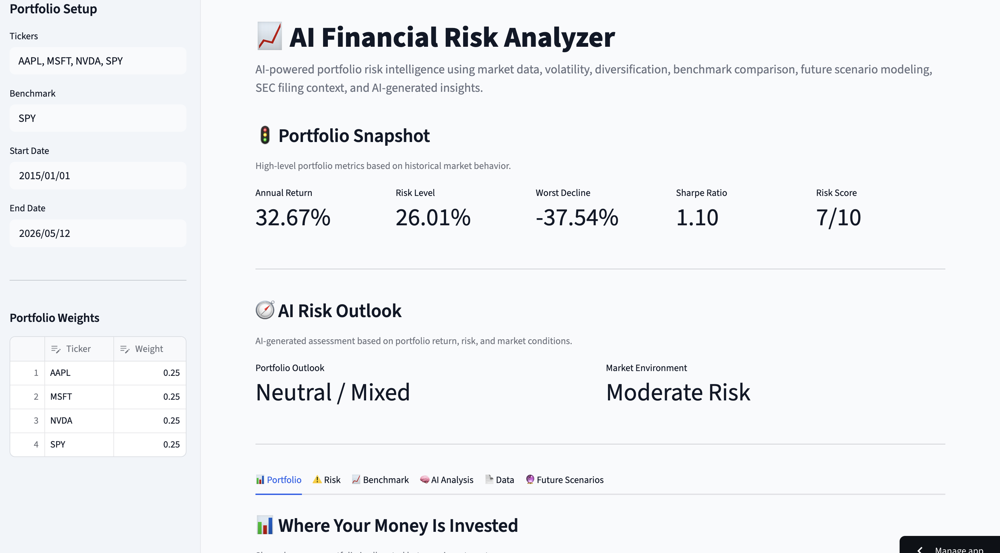
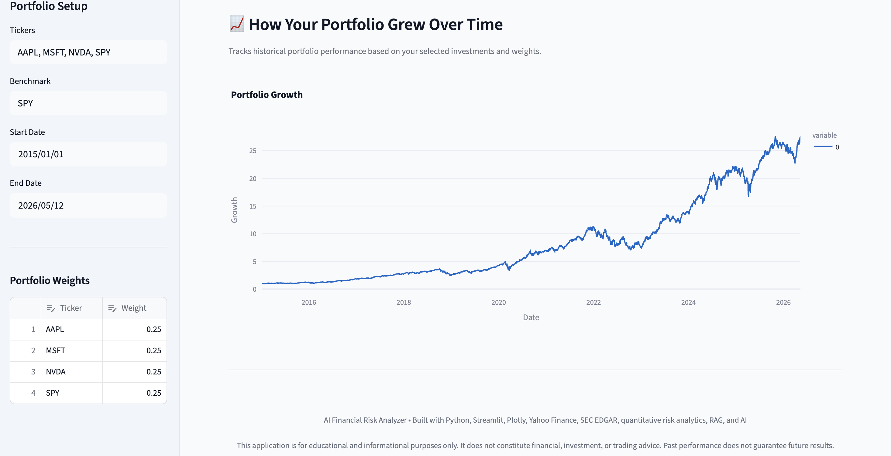
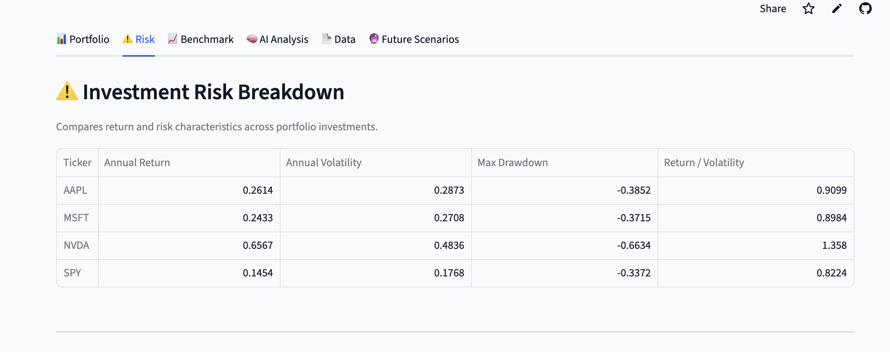
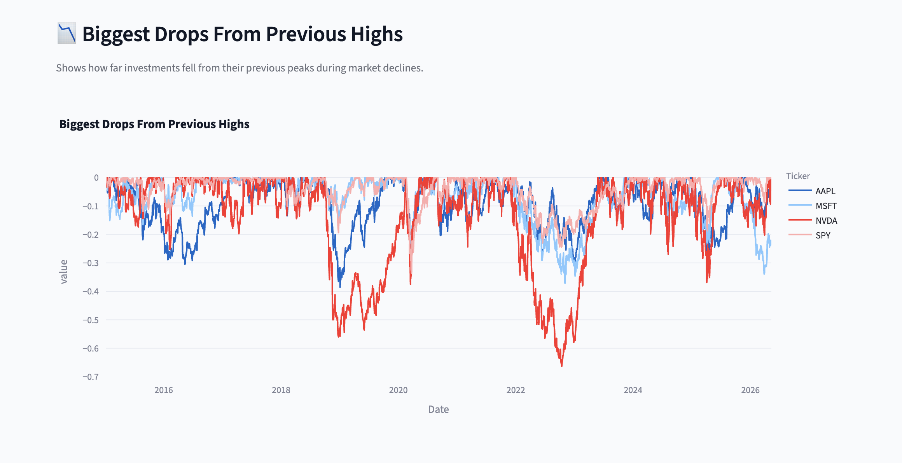
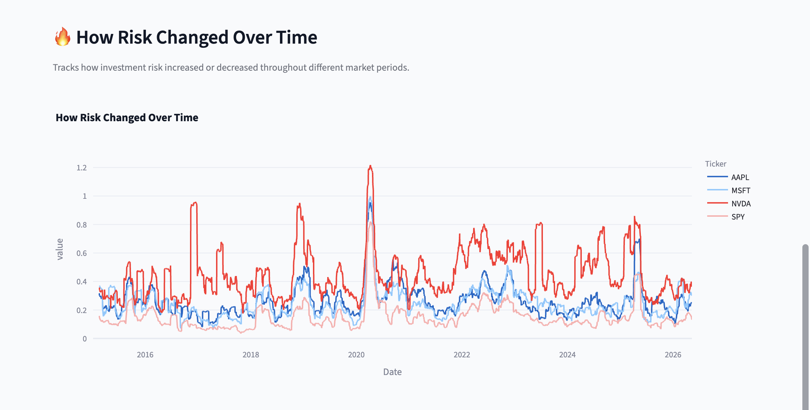
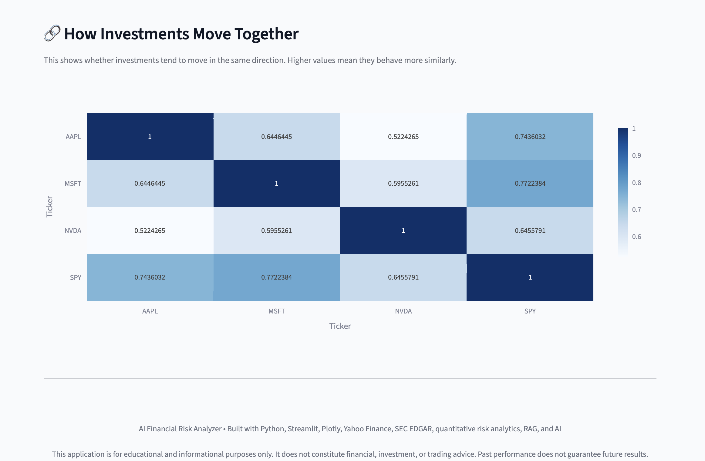
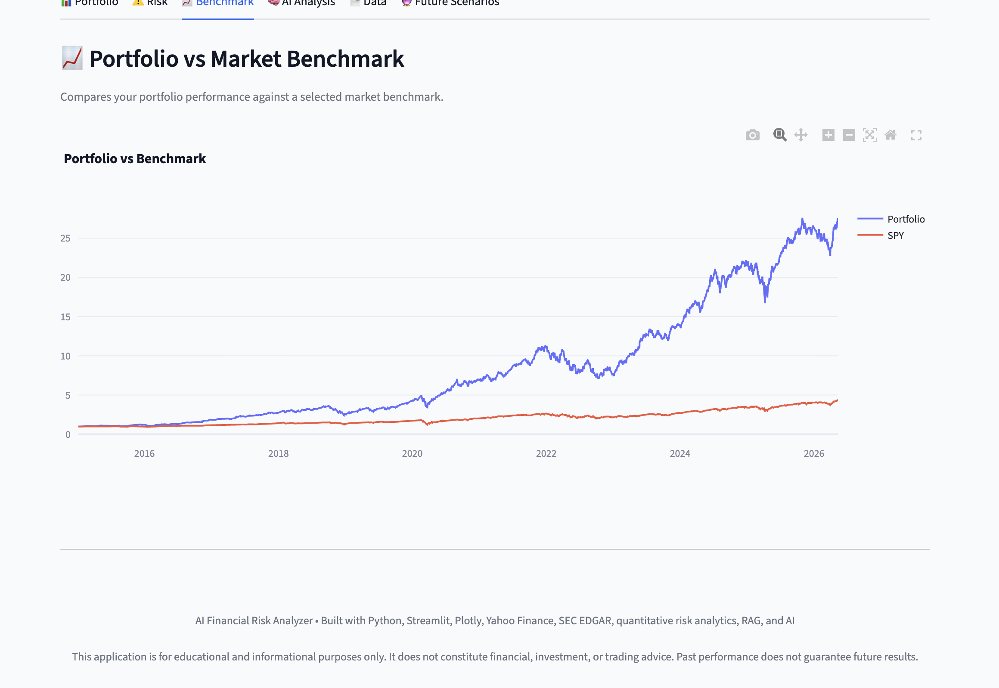
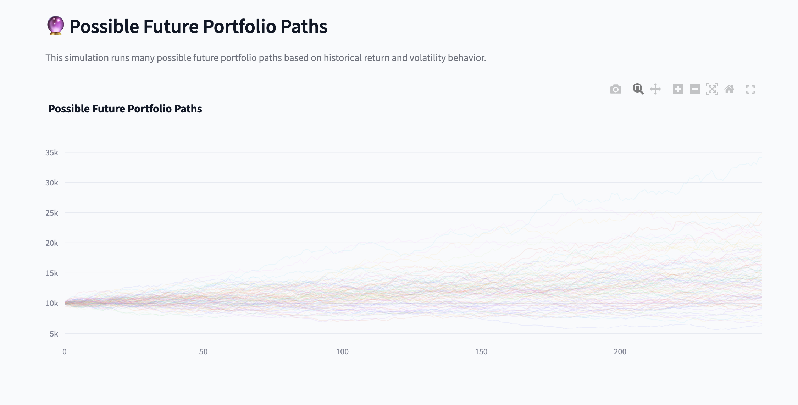
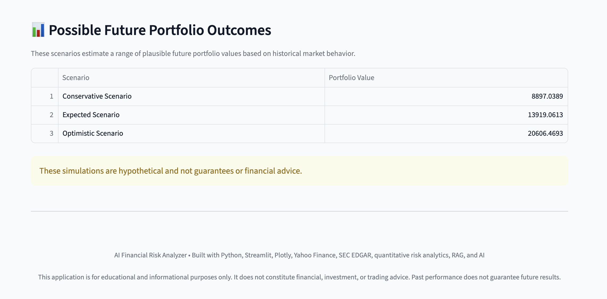

# AI Financial Risk Analyzer

A deployed AI-powered portfolio risk analytics app built with Python, Streamlit, Plotly, Yahoo Finance, SEC EDGAR filings, ChromaDB, and OpenAI.

Live App: https://ai-financial-risk-analyzer.streamlit.app/

## Overview

This project analyzes custom stock and ETF portfolios using quantitative risk metrics, interactive visualizations, benchmark comparison, future scenario modeling, and AI-generated explanations supported by SEC filing context.

The goal is to simulate how an AI-assisted financial risk analyst could combine market data, portfolio analytics, and company risk disclosures into a single dashboard.

## Features

- Custom stock and ETF ticker input
- Portfolio weight editing
- Historical return analysis
- Annualized volatility / risk level
- Worst historical decline / drawdown analysis
- Sharpe ratio
- Risk score
- Portfolio vs benchmark comparison
- Interactive Plotly charts
- Correlation analysis
- Monte Carlo future scenario simulation
- SEC 10-K filing retrieval
- RAG pipeline using ChromaDB
- AI-generated portfolio risk analysis
- Public Streamlit deployment

## Tech Stack

- Python
- Streamlit
- pandas
- numpy
- Plotly
- yfinance
- SEC EDGAR
- ChromaDB
- OpenAI API
- BeautifulSoup
- sec-edgar-downloader

## Architecture

## Architecture

```text
User-selected stock / ETF tickers
        ↓
Yahoo Finance market data retrieval
        ↓
Portfolio risk metrics and analytics
        ↓
SEC 10-K filing retrieval
        ↓
Risk-section extraction and text parsing
        ↓
ChromaDB vector storage and retrieval
        ↓
OpenAI-generated risk analysis using retrieved context
        ↓
Interactive Streamlit dashboard
```

## Dashboard Preview

### Main Dashboard



### Portfolio Allocation


### Portfolio Growth



### Investment Risk Breakdown



### Biggest Historical Declines



### Rolling Risk Trends



### Correlation Heatmap



### Portfolio vs Benchmark



### AI Risk Analysis


### Future Portfolio Simulations



### Future Portfolio Outcomes

